# 🏗️ QLTS - LEAD MANAGEMENT SYSTEM ARCHITECTURE

**Project:** QLTS (Quản Lý Tài Sản) - Lead Management Module
**Date:** 2025-11-13
**Version:** 1.0
**Status:** 📐 ARCHITECTURE DESIGN

---

## 📊 TABLE OF CONTENTS

1. [System Overview Diagram](#1-system-overview-diagram)
2. [Database ER Diagram](#2-database-er-diagram)
3. [Frontend Component Tree](#3-frontend-component-tree)
4. [API Architecture](#4-api-architecture)
5. [Data Flow Diagrams](#5-data-flow-diagrams)
6. [Security Architecture](#6-security-architecture)
7. [Deployment Architecture](#7-deployment-architecture)

---

## 1. SYSTEM OVERVIEW DIAGRAM

### High-Level Architecture

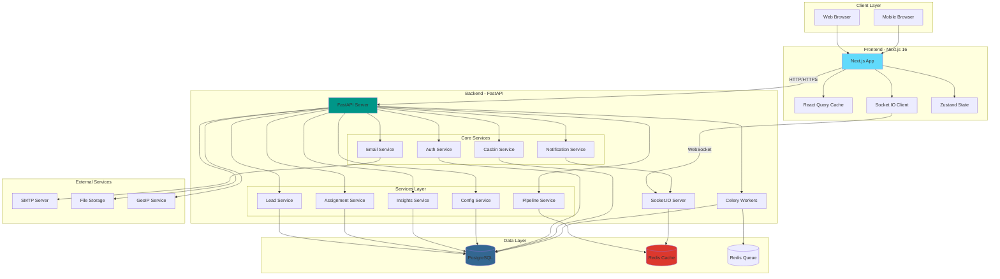

### Technology Stack

| Layer | Technology | Version | Purpose |
|-------|-----------|---------|---------|
| **Frontend** | Next.js | 16.0 | React framework with SSR |
| | React | 19.2 | UI library |
| | TypeScript | 5.x | Type safety |
| | Tailwind CSS | 4.x | Styling |
| | React Query | 5.90 | Server state management |
| | Zustand | 5.0 | Client state management |
| | Socket.IO Client | 4.8 | Real-time communication |
| | React Hook Form | 7.65 | Form management |
| | Zod | 4.1 | Schema validation |
| **Backend** | FastAPI | Latest | Python web framework |
| | Python | 3.11+ | Programming language |
| | SQLAlchemy | Latest | ORM |
| | Alembic | Latest | Database migrations |
| | Pydantic | Latest | Data validation |
| | Celery | Latest | Background tasks |
| | Socket.IO | Latest | Real-time server |
| | Casbin | Latest | Authorization |
| **Database** | PostgreSQL | 15+ | Primary database |
| | Redis | 7+ | Caching & pub/sub |
| **Testing** | Vitest | 4.0 | Unit/integration tests |
| | Playwright | 1.56 | E2E tests |
| | MSW | 2.8 | API mocking |
| | Pytest | Latest | Backend tests |

---

## 2. DATABASE ER DIAGRAM

### Lead Management Schema

```mermaid
erDiagram
    %% Core Tables
    USER ||--o{ LEAD : "assigned_to"
    USER ||--o{ CONSULTATION : "handles"
    USER ||--o{ APPLICATION : "handles"
    USER ||--o{ ASSIGNMENT_LOG : "assigned_by"

    ORGANIZATION_UNIT ||--o{ LEAD : "belongs_to"
    PROGRAM_OFFERING ||--o{ LEAD : "interested_in"

    LEAD ||--o{ CONSULTATION : "has"
    LEAD ||--o{ CRM_INTERACTION : "has"
    LEAD ||--o{ ASSIGNMENT_LOG : "has"
    LEAD ||--o| APPLICATION : "submits"
    LEAD ||--o{ LEAD_STATUS_HISTORY : "has"

    PIPELINE_STAGE ||--o{ LEAD : "in_stage"
    CONSULTATION_STATUS ||--o{ LEAD : "has_status"
    CONSULTATION_STATUS ||--o{ CONSULTATION : "has_status"
    PIPELINE_STAGE ||--o{ CONSULTATION_STATUS : "contains"

    %% Configuration Tables
    LEAD_SCORING_CONFIG ||--o{ LEAD : "scores"
    OFFICER_ASSIGNMENT_CONFIG ||--o{ USER : "configures"
    SKILL_REQUIREMENT_RULE ||--o{ PROGRAM_OFFERING : "requires"

    %% Entities

    USER {
        int id PK
        string username UK
        string email UK
        string password_hash
        string full_name
        string role
        string availability_status
        int max_capacity
        datetime created_at
    }

    LEAD {
        int id PK
        string full_name
        string email
        string phone
        string source
        string status
        int lead_score
        string education_level
        float gpa
        string location
        int officer_rating
        text officer_summary
        datetime created_at
        datetime updated_at
        datetime assigned_at
        int offering_id FK
        int unit_id FK
        int assigned_officer_id FK
        string consultation_status_id FK
        string pipeline_stage_id FK
    }

    CONSULTATION {
        int id PK
        int lead_id FK
        datetime consultation_date
        string method
        text notes
        string outcome
        int duration_minutes
        int officer_id FK
        string consultation_status_id FK
    }

    APPLICATION {
        int id PK
        int lead_id FK UK
        json documents
        string status
        int officer_id FK
    }

    CRM_INTERACTION {
        int id PK
        int lead_id FK
        string type
        json details
        datetime created_at
    }

    ASSIGNMENT_LOG {
        int id PK
        int lead_id FK
        string method
        datetime timestamp
        text reason
        int officer_id FK
    }

    LEAD_STATUS_HISTORY {
        int id PK
        int lead_id FK
        string old_status
        string new_status
        datetime changed_at
        int changed_by FK
        text reason
    }

    PIPELINE_STAGE {
        string id PK
        string name
        int order UK
    }

    CONSULTATION_STATUS {
        string id PK
        string name
        string color_code
        string stage_id FK
    }

    ORGANIZATION_UNIT {
        int id PK
        string name
        string code UK
        int parent_id FK
        string type
    }

    PROGRAM_OFFERING {
        int id PK
        string name
        string code UK
        int major_id FK
        string level
        int duration_months
    }

    LEAD_SCORING_CONFIG {
        int id PK
        string name
        json rules
        boolean is_active
        datetime created_at
    }

    OFFICER_ASSIGNMENT_CONFIG {
        int id PK
        int officer_id FK
        json preferences
        int max_capacity
        boolean auto_assign_enabled
    }

    SKILL_REQUIREMENT_RULE {
        int id PK
        int offering_id FK
        string required_skill
        int priority
    }
```

### Key Relationships

1. **Lead → User (assigned_officer_id)**
   - Many-to-One: Multiple leads can be assigned to one officer
   - Nullable: Leads can be unassigned

2. **Lead → PipelineStage (pipeline_stage_id)**
   - Many-to-One: Multiple leads in each pipeline stage
   - Required: All leads must be in a stage

3. **Lead → Consultation**
   - One-to-Many: A lead can have multiple consultations
   - Cascade delete: Consultations deleted when lead is deleted

4. **Lead → Application**
   - One-to-One: Each lead can have at most one application
   - Unique constraint on lead_id

5. **PipelineStage → ConsultationStatus**
   - One-to-Many: Each stage can have multiple statuses
   - Example: "Consultation Scheduled" stage has statuses: pending, completed, cancelled

---

## 3. FRONTEND COMPONENT TREE

### Application Structure

```mermaid
graph TB
    subgraph "App Layout"
        RootLayout[app/layout.tsx]
        RootLayout --> Providers[Providers]
        RootLayout --> DashboardLayout[app/dashboard/layout.tsx]
    end

    subgraph "Providers"
        Providers --> QueryClientProvider
        Providers --> AuthProvider
        Providers --> ThemeProvider
        Providers --> SocketProvider
        Providers --> ToastProvider
    end

    subgraph "Lead Pages"
        DashboardLayout --> LeadListPage[leads/page.tsx]
        DashboardLayout --> LeadDetailPage[leads/[id]/page.tsx]
        DashboardLayout --> PipelinePage[leads/pipeline/page.tsx]
        DashboardLayout --> InsightsPage[leads/insights/page.tsx]
    end

    subgraph "Lead List Components"
        LeadListPage --> LeadListTable
        LeadListPage --> LeadFilters
        LeadListPage --> LeadBulkActions
        LeadListPage --> LeadCreateDialog

        LeadListTable --> LeadRow
        LeadRow --> LeadQuickActions
        LeadRow --> LeadScoreBadge
        LeadRow --> StatusBadge

        LeadFilters --> MultiSelect
        LeadFilters --> DateRangePicker
        LeadFilters --> SearchInput
    end

    subgraph "Lead Detail Components"
        LeadDetailPage --> LeadDetailHeader
        LeadDetailPage --> TabsComponent[Tabs]

        TabsComponent --> OverviewTab
        TabsComponent --> TimelineTab
        TabsComponent --> ConsultationsTab
        TabsComponent --> InsightsTab

        OverviewTab --> LeadInfoCard
        OverviewTab --> ContactCard
        OverviewTab --> ProgramCard
        OverviewTab --> AssignmentCard

        TimelineTab --> TimelineList
        TimelineList --> TimelineItem

        ConsultationsTab --> ConsultationList
        ConsultationsTab --> ConsultationDialog
        ConsultationList --> ConsultationCard

        InsightsTab --> ScoreBreakdown
        InsightsTab --> EngagementMetrics
        InsightsTab --> RecommendedActions
        InsightsTab --> InsightsChart
    end

    subgraph "Pipeline Components"
        PipelinePage --> PipelineBoard
        PipelineBoard --> PipelineColumn
        PipelineColumn --> LeadCard
        PipelineBoard --> PipelineFilters
        PipelineColumn --> StageStats

        LeadCard --> DragHandle
        LeadCard --> LeadScoreBadge
    end

    subgraph "Insights Components"
        InsightsPage --> MetricCards
        InsightsPage --> LeadsOverTimeChart
        InsightsPage --> LeadsBySourceChart
        InsightsPage --> PipelineFunnelChart
        InsightsPage --> OfficerPerformanceTable
    end

    subgraph "Shared Dialogs"
        LeadCreateDialog --> LeadForm
        LeadEditDialog --> LeadForm
        LeadAssignDialog --> OfficerSelector
        ConsultationDialog --> ConsultationForm
        LeadImportDialog --> FileUploader
        LeadExportDialog --> ColumnSelector
    end

    subgraph "UI Components shadcn"
        Button
        Input
        Select
        Dialog
        Table
        Tabs
        Badge
        Card
        Form
        Popover
        Dropdown
    end

    LeadForm --> Input
    LeadForm --> Select
    LeadForm --> Button

    style LeadListPage fill:#e3f2fd
    style LeadDetailPage fill:#e3f2fd
    style PipelinePage fill:#e3f2fd
    style InsightsPage fill:#e3f2fd
```

### Component File Structure

```
frontend/src/
├── app/
│   ├── layout.tsx                          # Root layout
│   ├── providers.tsx                       # All providers
│   └── (dashboard)/
│       ├── layout.tsx                      # Dashboard layout
│       └── leads/
│           ├── page.tsx                    # Lead list page
│           ├── [id]/
│           │   └── page.tsx                # Lead detail page
│           ├── pipeline/
│           │   └── page.tsx                # Pipeline kanban
│           └── insights/
│               └── page.tsx                # Insights dashboard
│
├── components/
│   ├── ui/                                 # shadcn/ui components
│   │   ├── button.tsx
│   │   ├── input.tsx
│   │   ├── select.tsx
│   │   ├── dialog.tsx
│   │   ├── table.tsx
│   │   ├── tabs.tsx
│   │   ├── badge.tsx
│   │   └── ...
│   │
│   └── leads/                              # Lead-specific components
│       ├── LeadListTable.tsx              # Data table
│       ├── LeadFilters.tsx                # Filter sidebar
│       ├── LeadBulkActions.tsx            # Bulk actions toolbar
│       ├── LeadQuickActions.tsx           # Row actions
│       ├── LeadDetailHeader.tsx           # Detail page header
│       ├── LeadOverviewTab.tsx            # Overview tab
│       ├── LeadTimelineTab.tsx            # Timeline tab
│       ├── LeadConsultationsTab.tsx       # Consultations tab
│       ├── LeadInsightsTab.tsx            # Insights tab
│       ├── LeadInfoCard.tsx               # Lead info card
│       ├── TimelineItem.tsx               # Timeline event
│       ├── ConsultationCard.tsx           # Consultation card
│       ├── InsightsChart.tsx              # Insights charts
│       ├── LeadCreateDialog.tsx           # Create dialog
│       ├── LeadEditDialog.tsx             # Edit dialog
│       ├── LeadAssignDialog.tsx           # Assign dialog
│       ├── ConsultationDialog.tsx         # Consultation dialog
│       ├── LeadImportDialog.tsx           # Import dialog
│       ├── LeadExportDialog.tsx           # Export dialog
│       ├── PipelineBoard.tsx              # Kanban board
│       ├── PipelineColumn.tsx             # Kanban column
│       ├── LeadCard.tsx                   # Kanban card
│       ├── PipelineFilters.tsx            # Pipeline filters
│       └── StageStats.tsx                 # Stage statistics
│
├── hooks/
│   ├── useLeads.ts                        # Lead list hooks
│   ├── useLead.ts                         # Single lead hooks
│   ├── useLeadAssignment.ts               # Assignment hooks
│   ├── useConsultations.ts                # Consultation hooks
│   ├── usePipeline.ts                     # Pipeline hooks
│   └── useLeadInsights.ts                 # Insights hooks
│
├── lib/
│   ├── api/
│   │   ├── client.ts                      # Axios client
│   │   ├── leads.ts                       # Lead API
│   │   └── pipeline.ts                    # Pipeline API
│   │
│   ├── stores/
│   │   ├── auth.store.ts                  # Auth state
│   │   └── ui.store.ts                    # UI state
│   │
│   └── utils/
│       ├── cn.ts                          # Class name utils
│       ├── format.ts                      # Formatters
│       └── validation.ts                  # Validators
│
└── types/
    ├── lead.types.ts                      # Lead types
    └── pipeline.types.ts                  # Pipeline types
```

---

## 4. API ARCHITECTURE

### API Endpoint Structure

```mermaid
graph LR
    subgraph "API Routes"
        Root[/api]

        Root --> Auth[/auth]
        Root --> Leads[/leads]
        Root --> Pipeline[/pipeline]
        Root --> Admin[/admin]

        Auth --> Login[POST /login]
        Auth --> Logout[POST /logout]
        Auth --> Refresh[POST /refresh]
        Auth --> Me[GET /me]

        Leads --> LeadsCRUD[CRUD Operations]
        Leads --> LeadsActions[Actions]
        Leads --> LeadsData[Data Access]

        LeadsCRUD --> CreateLead[POST /]
        LeadsCRUD --> GetLeads[GET /]
        LeadsCRUD --> GetLead[GET /:id]
        LeadsCRUD --> UpdateLead[PUT /:id]

        LeadsActions --> AssignLead[POST /:id/assign]
        LeadsActions --> LeadAction[POST /:id/action]
        LeadsActions --> AddConsult[POST /:id/consultations]

        LeadsData --> Timeline[GET /:id/timeline]
        LeadsData --> Insights[GET /:id/insights]

        Pipeline --> GetStages[GET /stages]
        Pipeline --> GetFull[GET /all]

        Admin --> AdminLeads[/leads]
        Admin --> AdminPipeline[/pipeline-stages]
        Admin --> AdminConfig[/config]

        AdminLeads --> BulkAssign[POST /bulk-assign]
        AdminLeads --> ImportLeads[POST /import]
        AdminLeads --> ExportLeads[GET /export]

        AdminPipeline --> CreateStage[POST /]
        AdminPipeline --> UpdateStage[PUT /:id]
        AdminPipeline --> DeleteStage[DELETE /:id]
    end

    style Root fill:#4CAF50
    style Auth fill:#2196F3
    style Leads fill:#FF9800
    style Pipeline fill:#9C27B0
    style Admin fill:#F44336
```

### API Request/Response Flow

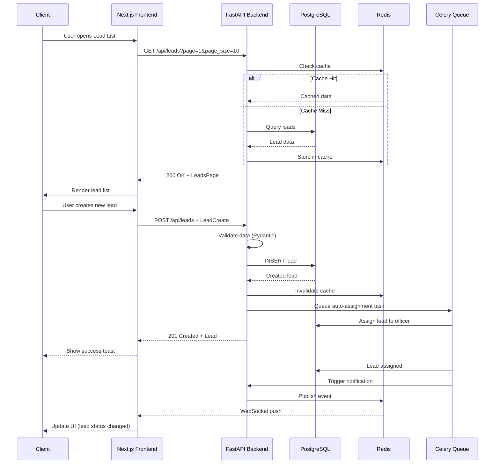

### Middleware Stack

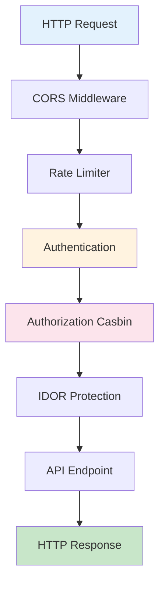

---

## 5. DATA FLOW DIAGRAMS

### Lead Creation Flow

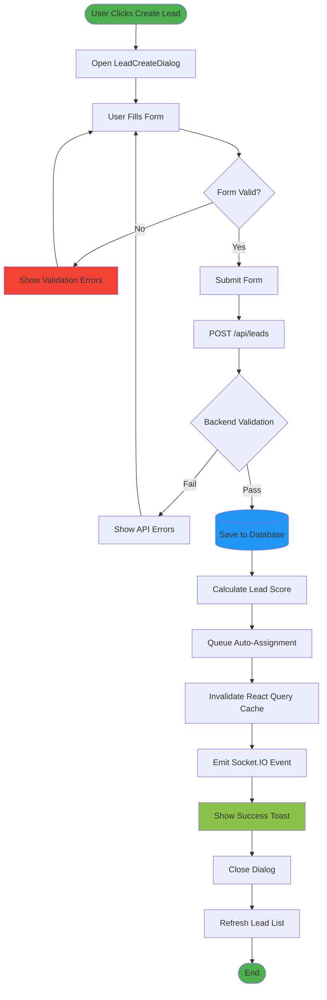

### Lead Assignment Flow

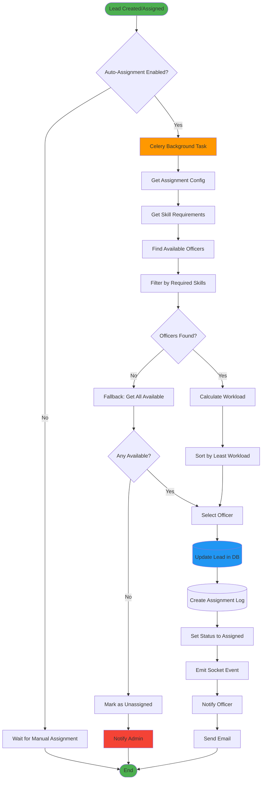

### Pipeline Stage Movement

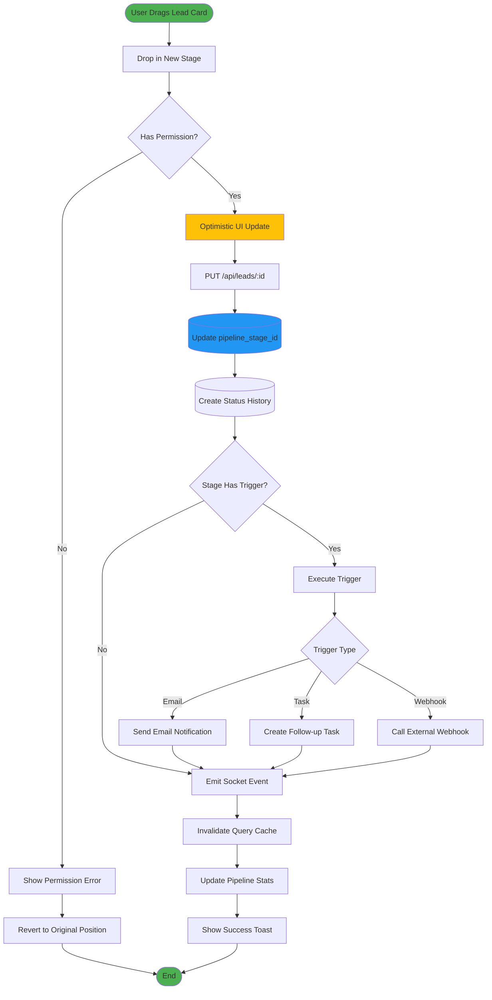

---

## 6. SECURITY ARCHITECTURE

### Authentication & Authorization Flow

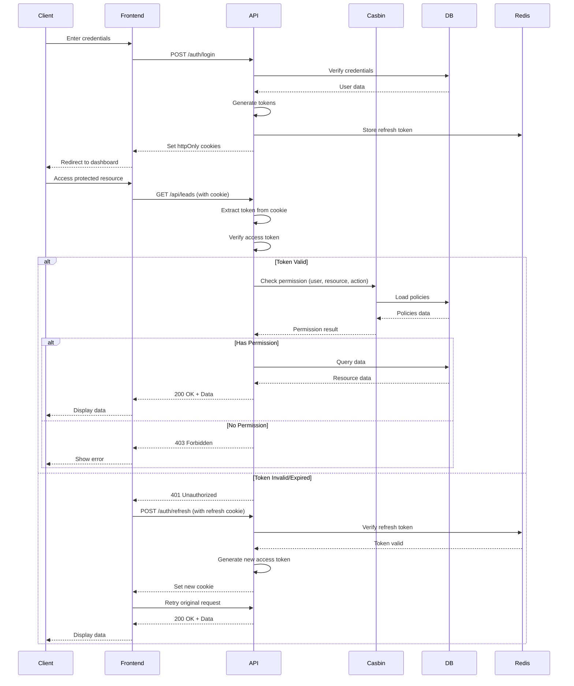

### Permission Matrix

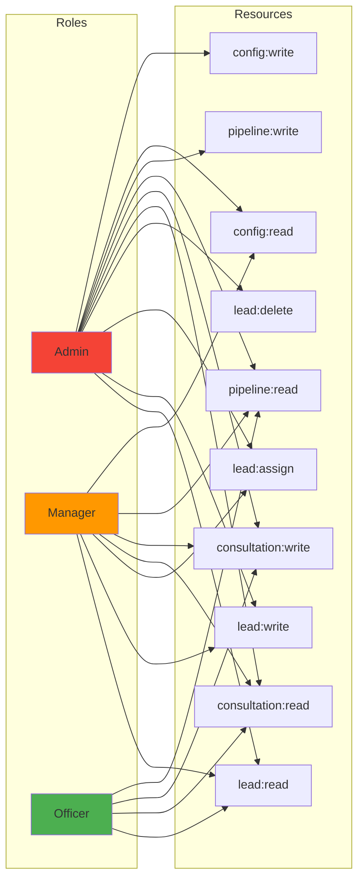

### IDOR Protection

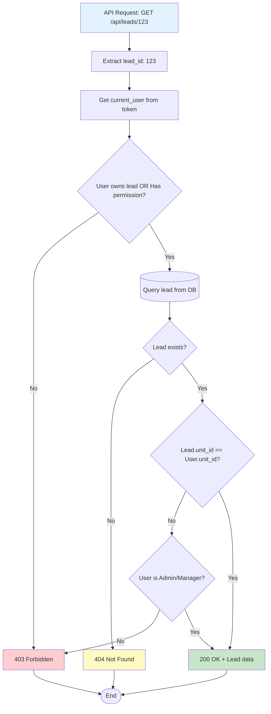

---

## 7. DEPLOYMENT ARCHITECTURE

### Production Infrastructure

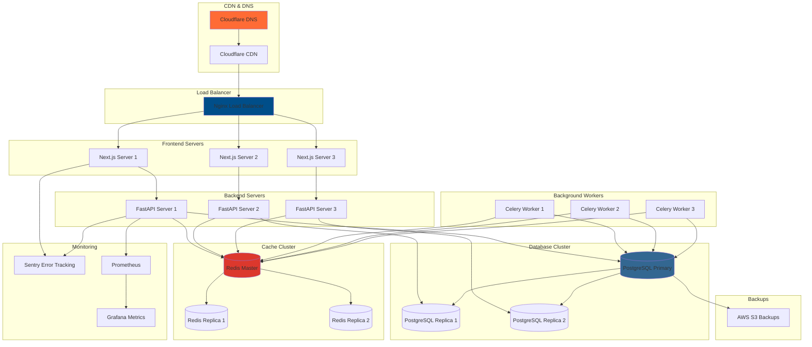

### Container Architecture (Docker)

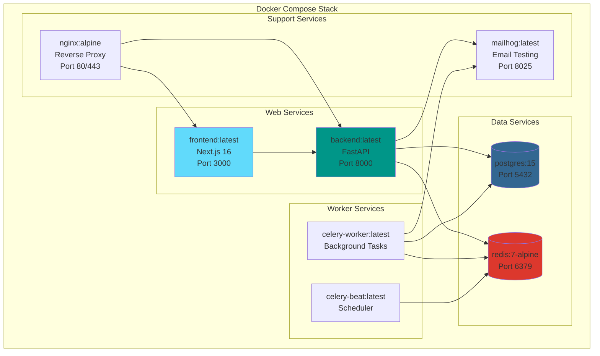

### CI/CD Pipeline

```mermaid
flowchart LR
    subgraph "Development"
        Dev[Developer Push]
        Git[GitHub Repo]
    end

    subgraph "CI Pipeline"
        Lint[Linting<br/>ESLint/Ruff]
        Test[Unit Tests<br/>Vitest/Pytest]
        Build[Build<br/>Docker Images]
        Scan[Security Scan<br/>Trivy]
    end

    subgraph "CD Pipeline"
        Push[Push to Registry<br/>Docker Hub]
        DeployStaging[Deploy to Staging]
        E2E[E2E Tests<br/>Playwright]
        DeployProd[Deploy to Production]
    end

    subgraph "Monitoring"
        Health[Health Checks]
        Metrics[Collect Metrics]
        Alerts[Send Alerts]
    end

    Dev --> Git
    Git --> Lint
    Lint --> Test
    Test --> Build
    Build --> Scan

    Scan --> Push
    Push --> DeployStaging
    DeployStaging --> E2E

    E2E -->|Pass| DeployProd
    E2E -->|Fail| Alerts

    DeployProd --> Health
    Health --> Metrics
    Metrics --> Alerts

    style Dev fill:#4CAF50
    style DeployProd fill:#2196F3
    style Alerts fill:#F44336
```

---

## 📚 REFERENCES

### External Documentation

- **Next.js:** https://nextjs.org/docs
- **FastAPI:** https://fastapi.tiangolo.com/
- **React Query:** https://tanstack.com/query/latest
- **Casbin:** https://casbin.org/docs/overview
- **Socket.IO:** https://socket.io/docs/v4/
- **PostgreSQL:** https://www.postgresql.org/docs/
- **Redis:** https://redis.io/docs/
- **Mermaid Diagrams:** https://mermaid.js.org/

### Internal Documentation

- `LEAD_MANAGEMENT_IMPLEMENTATION_PLAN.md` - Original implementation plan
- `LEAD_MANAGEMENT_PLAN_REVIEW.md` - Plan review & recommendations
- `BACKEND_VERIFICATION_REPORT.md` - Backend verification results
- `TESTING_INFRASTRUCTURE_SETUP.md` - Testing setup documentation
- `frontend/src/test/README.md` - Testing guide

---

## 📝 NOTES

### Diagram Rendering

These diagrams use **Mermaid** syntax and can be rendered in:
- GitHub (native support)
- VS Code (with Mermaid extension)
- Notion (with Mermaid integration)
- Obsidian (with Mermaid plugin)
- Online: https://mermaid.live/

### Updating Diagrams

When system architecture changes:
1. Update relevant diagrams in this file
2. Commit changes with descriptive message
3. Notify team via Slack/Email
4. Update API documentation if needed

---

**Document Version:** 1.0
**Last Updated:** 2025-11-13
**Maintained By:** Development Team
**Status:** ✅ COMPLETE
