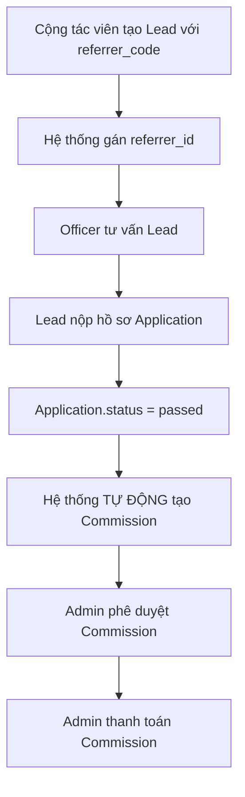

# 🎯 Hệ thống Quản lý Cộng tác viên & Hoa hồng

## Tổng quan

Hệ thống này cho phép:
- ✅ Cộng tác viên giới thiệu lead vào hệ thống
- ✅ Theo dõi quá trình tư vấn lead
- ✅ Tự động tính và trả hoa hồng khi lead nhập học thành công

## Các thành phần đã triển khai

### 1. Database Models

| Model | Mục đích |
|-------|----------|
| `Collaborator` | Thông tin cộng tác viên (CTV) |
| `CommissionPolicy` | Chính sách hoa hồng (% hoặc số tiền cố định) |
| `Commission` | Ghi nhận hoa hồng phát sinh |
| `Lead` (cập nhật) | Thêm `referrer_id` và `referrer_code` |

### 2. Files đã tạo

```
Backend_FastAPI/
├── alembic/versions/
│   └── w8x9y0z1a2b3_add_collaborator_commission_models.py  ← Migration
├── app/
│   ├── models/
│   │   ├── collaborator.py                                 ← Model mới
│   │   └── commission.py                                   ← Model mới
│   └── schemas/
│       ├── collaborator.py                                 ← Schema mới
│       └── commission.py                                   ← Schema mới
└── HUONG_DAN_TRIEN_KHAI_CONG_TAC_VIEN.md                   ← Tài liệu hướng dẫn
```

### 3. Luồng nghiệp vụ



## Cách sử dụng

### Bước 1: Chạy Migration

```bash
cd Backend_FastAPI
alembic upgrade head
```

### Bước 2: Tạo Cộng tác viên

```bash
POST /api/collaborators
{
  "full_name": "Nguyễn Văn A",
  "email": "ctv@example.com",
  "phone": "0901234567",
  "category": "VIP"
}
```

**Response**: Nhận mã CTV (ví dụ: `CTV001`)

### Bước 3: Tạo Chính sách Hoa hồng

```bash
POST /api/admin/commission-policies
{
  "name": "Hoa hồng 5%",
  "calculation_type": "percentage",
  "percentage_value": 5.00,
  "effective_start_date": "2025-01-01T00:00:00"
}
```

### Bước 4: Cộng tác viên tạo Lead

```bash
POST /api/leads
{
  "full_name": "Trần Thị B",
  "email": "student@example.com",
  "phone": "0987654321",
  "referrer_code": "CTV001"  ← Mã cộng tác viên
}
```

### Bước 5: Lead nhập học → Tự động tạo hoa hồng

Khi Application chuyển status sang `"passed"`:

```bash
PUT /api/applications/{id}
{
  "status": "passed"
}
```

**Hệ thống tự động**:
1. ✅ Tìm chính sách hoa hồng phù hợp
2. ✅ Tính số tiền hoa hồng
3. ✅ Tạo Commission record với status = "pending"
4. ✅ Cập nhật thống kê Collaborator

### Bước 6: Admin phê duyệt & thanh toán

```bash
# Phê duyệt
POST /api/admin/commissions/{id}/approve

# Thanh toán
POST /api/admin/commissions/{id}/pay
```

## Các tính năng nổi bật

### 1. Tính hoa hồng linh hoạt

- **Percentage**: Tính theo % học phí (vd: 5%, 10%)
- **Fixed Amount**: Số tiền cố định (vd: 2,000,000 VND)

### 2. Chính sách có điều kiện

- Áp dụng cho ngành/chương trình cụ thể
- Phân biệt theo category cộng tác viên (VIP, Standard, ...)
- Học phí tối thiểu để được hưởng hoa hồng
- Có hiệu lực theo thời gian

### 3. Thống kê tự động

Mỗi Collaborator có:
- `total_leads`: Tổng số lead đã giới thiệu
- `successful_leads`: Số lead nhập học thành công
- `total_commission_earned`: Tổng hoa hồng đã nhận
- `pending_commission`: Hoa hồng chờ thanh toán

### 4. Audit Trail đầy đủ

- Ai phê duyệt? Khi nào?
- Ai thanh toán? Khi nào?
- Lý do từ chối (nếu có)

## API Endpoints

### Collaborators

| Method | Endpoint | Mô tả |
|--------|----------|-------|
| POST | `/api/collaborators` | Tạo cộng tác viên |
| GET | `/api/collaborators` | Danh sách cộng tác viên |
| GET | `/api/collaborators/{id}` | Chi tiết cộng tác viên |
| PUT | `/api/collaborators/{id}` | Cập nhật thông tin |
| GET | `/api/collaborators/{id}/leads` | Leads của CTV |
| GET | `/api/collaborators/{id}/commissions` | Hoa hồng của CTV |
| GET | `/api/collaborators/{id}/stats` | Thống kê CTV |

### Commission Policies (Admin)

| Method | Endpoint | Mô tả |
|--------|----------|-------|
| POST | `/api/admin/commission-policies` | Tạo chính sách |
| GET | `/api/admin/commission-policies` | Danh sách chính sách |
| GET | `/api/admin/commission-policies/{id}` | Chi tiết chính sách |
| PUT | `/api/admin/commission-policies/{id}` | Cập nhật chính sách |
| DELETE | `/api/admin/commission-policies/{id}` | Xóa chính sách |

### Commissions (Admin)

| Method | Endpoint | Mô tả |
|--------|----------|-------|
| GET | `/api/admin/commissions` | Danh sách hoa hồng |
| GET | `/api/admin/commissions/{id}` | Chi tiết hoa hồng |
| POST | `/api/admin/commissions/{id}/approve` | Phê duyệt |
| POST | `/api/admin/commissions/{id}/reject` | Từ chối |
| POST | `/api/admin/commissions/{id}/pay` | Thanh toán |

## Ví dụ sử dụng thực tế

### Tình huống: Cộng tác viên VIP giới thiệu sinh viên ngành CNTT

1. **Setup ban đầu**:
   - Admin tạo Collaborator: `CTV001` - Nguyễn Văn A (category: VIP)
   - Admin tạo Policy: "VIP 10%" - Hoa hồng 10% cho CTV VIP

2. **CTV giới thiệu lead**:
   ```json
   POST /api/leads
   {
     "full_name": "Trần Thị B",
     "email": "tranthi@gmail.com",
     "phone": "0987654321",
     "offering_id": 5,  // Cao đẳng CNTT
     "referrer_code": "CTV001"
   }
   ```

3. **Officer tư vấn**: Tạo các buổi Consultation

4. **Lead nhập học**:
   ```json
   PUT /api/applications/123
   {
     "status": "passed"  // Học phí: 20,000,000 VND
   }
   ```

5. **Hệ thống tự động tính**:
   - Tìm policy: "VIP 10%" (vì CTV001 là VIP)
   - Tính hoa hồng: 20,000,000 × 10% = 2,000,000 VND
   - Tạo Commission với status = "pending"
   - Cập nhật Collaborator:
     - `successful_leads += 1`
     - `pending_commission += 2,000,000`

6. **Admin phê duyệt & thanh toán**:
   ```bash
   POST /api/admin/commissions/456/approve
   POST /api/admin/commissions/456/pay
   ```

## Lưu ý khi triển khai

### ⚠️ Cần hoàn thiện:

1. **Services**:
   - Tạo file `app/services/collaborator_service.py`
   - Tạo file `app/services/commission_service.py`
   - Implement đầy đủ logic theo hướng dẫn

2. **Routers**:
   - Tạo file `app/routers/collaborators.py`
   - Tạo file `app/routers/admin/commissions.py`
   - Đăng ký trong `app/main.py`

3. **Cập nhật Lead Router**:
   - Thêm xử lý `referrer_code` khi tạo lead
   - Cập nhật `total_leads` của Collaborator

4. **Cập nhật Application Router**:
   - Thêm trigger tạo commission khi `status = "passed"`

5. **Phân quyền (Casbin)**:
   - Thêm policies cho collaborator endpoints
   - Chỉ admin được approve/pay commission

6. **Notification**:
   - Thông báo cho CTV khi có hoa hồng mới
   - Thông báo khi hoa hồng được phê duyệt/thanh toán

### ✅ Best Practices:

1. **Transaction Safety**: Wrap commission creation trong transaction
2. **Logging**: Log tất cả actions liên quan đến tiền
3. **Validation**: Validate chính sách trước khi tạo commission
4. **Testing**: Viết unit tests cho commission calculation
5. **Monitoring**: Track commission metrics (total, pending, paid)

## Tài liệu chi tiết

Xem file `HUONG_DAN_TRIEN_KHAI_CONG_TAC_VIEN.md` để có hướng dẫn triển khai đầy đủ.

---

**Phiên bản**: 1.0.0
**Ngày tạo**: 2025-11-28
**Tác giả**: Claude Agent
