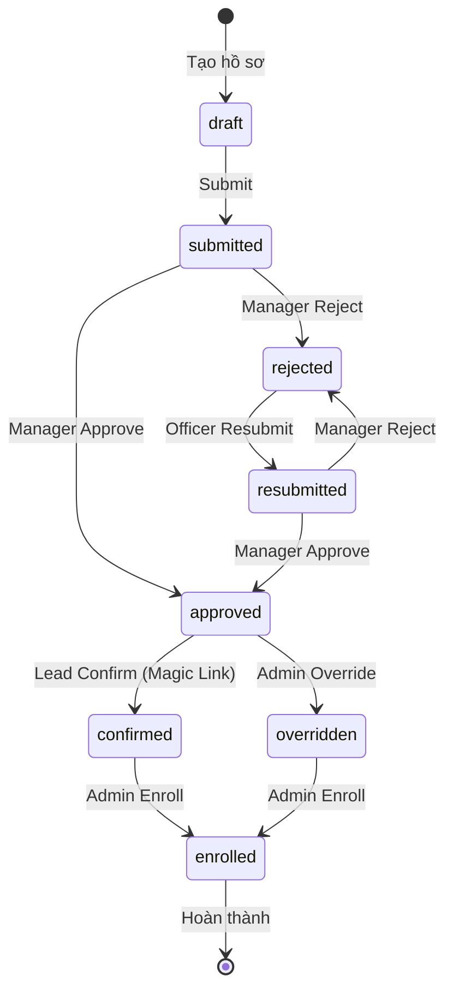

# Admission Flow - Tổng Quan Hệ Thống

## Mục lục
1. [State Machine](#1-state-machine)
2. [Quy Trình Tạo Hồ Sơ](#2-quy-trình-tạo-hồ-sơ)
3. [Quy Trình Submit & Auto-Validation](#3-quy-trình-submit--auto-validation)
4. [Quy Trình Phê Duyệt](#4-quy-trình-phê-duyệt)
5. [Quy Trình Xác Nhận (Magic Link)](#5-quy-trình-xác-nhận-magic-link)
6. [Quy Trình Enroll](#6-quy-trình-enroll)
7. [Cấu Trúc Dữ Liệu](#7-cấu-trúc-dữ-liệu)

---

## 1. State Machine



### Trạng Thái

| Status | Mô tả | Ai thực hiện |
|--------|-------|--------------|
| `draft` | Hồ sơ mới tạo, đang nhập liệu | Officer |
| `submitted` | Đã nộp, chờ xét duyệt | System (auto) |
| [approved](file:///d:/QLTS/Backend_FastAPI/tests/integration/test_admission_state_transitions.py#244-284) | Đã duyệt | Manager |
| [rejected](file:///d:/QLTS/Backend_FastAPI/tests/integration/test_admission_state_transitions.py#817-853) | Bị từ chối | Manager |
| `resubmitted` | Đã sửa và nộp lại | Officer |
| [confirmed](file:///d:/QLTS/Backend_FastAPI/app/repositories/admission_repository.py#452-478) | Lead đã xác nhận nhập học | Lead (via Magic Link) |
| `overridden` | Admin bypass quy trình | Admin |
| [enrolled](file:///d:/QLTS/Backend_FastAPI/app/repositories/admission_repository.py#192-214) | Đã trở thành sinh viên | Admin |

### Các Transition Cho Phép

```python
ALLOWED_TRANSITIONS = {
    "draft":       {"submitted"},
    "submitted":   {"approved", "rejected"},
    "rejected":    {"resubmitted"},
    "resubmitted": {"approved", "rejected"},
    "approved":    {"confirmed", "overridden"},
    "confirmed":   {"enrolled"},
    "overridden":  {"enrolled"},
    "enrolled":    {},  # FINAL - không đi tiếp
}
```

---

## 2. Quy Trình Tạo Hồ Sơ

### Endpoint
```
POST /api/admissions
Body: { "lead_id": int }
```

### Flow

```
┌──────────────────────────────────────────────────────────────────┐
│ 1. Officer gọi POST /api/admissions { lead_id: 123 }             │
└──────────────────────────────────────────────────────────────────┘
                                 ↓
┌──────────────────────────────────────────────────────────────────┐
│ 2. IDOR Check: lead.unit_id == current_user.unit_id?             │
│    • Admin: bypass                                               │
│    • Fail → 403 PermissionDenied                                 │
└──────────────────────────────────────────────────────────────────┘
                                 ↓
┌──────────────────────────────────────────────────────────────────┐
│ 3. Validation:                                                   │
│    • Lead tồn tại? → 404 nếu không                               │
│    • Lead có offering_id? → 400 nếu không                        │
│    • Lead đã có admission_profile? → 400 nếu có                  │
└──────────────────────────────────────────────────────────────────┘
                                 ↓
┌──────────────────────────────────────────────────────────────────┐
│ 4. SNAPSHOT admission_rules từ ProgramOffering và AcademicInfo:  │
│    - ProgramOffering.admission_rules (generic rules)             │
│    - OfferingAcademicInfo.admission_criteria (dynamic rules)     │
│    → Merge vào applied_rules (KHÔNG BAO GIỜ thay đổi)            │
│    {                                                             │
│      "min_gpa": 6.0,                                             │
│      "mandatory_docs": [...],                                    │
│      "criteria": [ { subjects: [...], min_score: 18.0 } ]        │
│    }                                                             │
└──────────────────────────────────────────────────────────────────┘
                                 ↓
┌──────────────────────────────────────────────────────────────────┐
│ 5. Auto-create ProfileDocument records từ mandatory_docs:        │
│    • Mỗi doc_code → 1 row trong ProfileDocument                  │
│    • status = "pending", file_path = NULL                        │
└──────────────────────────────────────────────────────────────────┘
                                 ↓
┌──────────────────────────────────────────────────────────────────┐
│ 6. Tạo AdmissionProfile:                                         │
│    • status = "draft"                                            │
│    • version = 1                                                 │
│    • applied_rules = snapshot từ step 4                          │
└──────────────────────────────────────────────────────────────────┘
```

### Dữ Liệu Được Tạo

| Table | Records |
|-------|---------|
| [admission_profile](file:///d:/QLTS/Backend_FastAPI/app/routers/admissions.py#179-223) | 1 row (status=draft) |
| `profile_document` | N rows (1 per mandatory_doc) |
| [profile_score](file:///d:/QLTS/Backend_FastAPI/app/repositories/admission_repository.py#498-516) | 0 rows (chưa có điểm) |

---

## 3. Quy Trình Submit & Auto-Validation

### Endpoint
```
POST /api/admissions/{profile_id}/submit
```

### Flow

```
┌──────────────────────────────────────────────────────────────────┐
│ 1. Officer gọi POST /submit                                      │
│    • Profile phải ở status = "draft"                             │
└──────────────────────────────────────────────────────────────────┘
                                 ↓
┌──────────────────────────────────────────────────────────────────┐
│ 2. AUTO-VALIDATION (dựa trên applied_rules snapshot):            │
│                                                                  │
│    ✓ GPA Check (Dynamic Scoring):                                │
│      - Nguồn: bảng profile_subject_score                         │
│      - Logic: Tính GPA từ các môn đã nhập                        │
│      - Check 1: Có điểm chưa? (scores > 0)                       │
│      - Check 2: GPA >= applied_rules.min_gpa                     │
│                                                                  │
│    ✓ Document Check:                                             │
│      Tất cả mandatory_docs phải có:                              │
│      - profile_document.status = "uploaded"                      │
│      - profile_document.file_path != NULL                        │
│                                                                  │
│    ✓ Required Fields Check:                                      │
│      - citizen_id NOT NULL                                       │
│      - citizen_id UNIQUE (validation với học viên cũ)            │
└──────────────────────────────────────────────────────────────────┘
                                 ↓
┌──────────────────────────────────────────────────────────────────┐
│ 3. Kết quả:                                                      │
│                                                                  │
│    ✅ PASS tất cả → status = "submitted"                         │
│       Response: { status: "submitted", validation_errors: [] }   │
│                                                                  │
│    ❌ FAIL → status vẫn "draft"                                  │
│       Response: { status: "draft", validation_errors: [...] }    │
└──────────────────────────────────────────────────────────────────┘
```

### Validation Errors Format

```json
{
  "validation_errors": [
    { "field": "gpa", "error": "GPA 5.5 < minimum 6.0" },
    { "field": "cccd", "error": "Document not uploaded" }
  ]
}
```

---

## 4. Quy Trình Phê Duyệt

### Endpoints

| Action | Endpoint | Role |
|--------|----------|------|
| Approve | `POST /api/admissions/{id}/approve` | Manager, Admin |
| Reject | `POST /api/admissions/{id}/reject` | Manager, Admin |
| Resubmit | `POST /api/admissions/{id}/resubmit` | Officer |

### Approve Flow

```
Manager gọi POST /approve { notes: "Đạt yêu cầu" }
         ↓
validate_transition("submitted", "approved") ← state machine check
         ↓
profile.status = "approved"
profile.version += 1
         ↓
✅ Ready for confirmation
```

### Reject Flow

```
Manager gọi POST /reject { reason: "Thiếu giấy tờ" }
         ↓
validate_transition("submitted", "rejected")
         ↓
profile.status = "rejected"
profile.rejection_reason = "Thiếu giấy tờ"
         ↓
Officer có thể sửa và resubmit
```

---

## 5. Quy Trình Xác Nhận (Magic Link)

### Endpoints

| Action | Endpoint | Auth |
|--------|----------|------|
| Send link | `POST /api/admissions/{id}/send-confirmation` | Manager, Officer |
| Get info | `GET /api/admissions/confirm/{token}` | **PUBLIC** |
| Confirm | `POST /api/admissions/confirm/{token}` | **PUBLIC** |

### Flow

```
┌──────────────────────────────────────────────────────────────────┐
│ 1. Manager gửi magic link (sau khi approve):                     │
│    POST /admissions/{id}/send-confirmation                       │
│    → Tạo AdmissionConfirmationToken                              │
│    → Gửi email/SMS cho Lead                                      │
└──────────────────────────────────────────────────────────────────┘
                                 ↓
┌──────────────────────────────────────────────────────────────────┐
│ 2. Lead click link trong email:                                  │
│    https://app.edu.vn/confirm?token=abc123...                    │
└──────────────────────────────────────────────────────────────────┘
                                 ↓
┌──────────────────────────────────────────────────────────────────┐
│ 3. Frontend gọi GET /confirm/{token}                             │
│    Response:                                                     │
│    {                                                             │
│      "valid": true,                                              │
│      "profile_name": "Nguyễn Văn A",                             │
│      "attempts_remaining": 5                                     │
│    }                                                             │
└──────────────────────────────────────────────────────────────────┘
                                 ↓
┌──────────────────────────────────────────────────────────────────┐
│ 4. Lead nhập 4 số cuối CCCD và submit:                           │
│    POST /confirm/{token} { "last_digits_citizen_id": "1234" }    │
│                                                                  │
│    ✅ Đúng → status = "confirmed"                                │
│    ❌ Sai  → attempt_count++, max 5 lần rồi lock                 │
└──────────────────────────────────────────────────────────────────┘
```

### Token Security

| Feature | Value |
|---------|-------|
| Token length | 256-bit (43 chars base64url) |
| Expiration | 7 ngày (configurable) |
| Max attempts | 5 (configurable) |
| CCCD digits | 4 số cuối (configurable) |

---

## 6. Quy Trình Enroll

### Endpoint
```
POST /api/admissions/{profile_id}/enroll
Role: Admin only
```

### Flow

```
┌──────────────────────────────────────────────────────────────────┐
│ 1. Admin gọi POST /enroll                                        │
│    • Profile phải ở: "approved", "confirmed", hoặc "overridden"  │
└──────────────────────────────────────────────────────────────────┘
                                 ↓
┌──────────────────────────────────────────────────────────────────┐
│ 2. Generate student_code với Redis distributed lock:             │
│    Format: SV{YEAR}{4-digit-random}                              │
│    Example: SV20260001                                           │
└──────────────────────────────────────────────────────────────────┘
                                 ↓
┌──────────────────────────────────────────────────────────────────┐
│ 3. ACID Transaction (Savepoint):                                 │
│    BEGIN SAVEPOINT                                               │
│    • Insert Student record                                       │
│    • Insert StudentDocument records (copy từ ProfileDocument)    │
│    • Update profile.status = "enrolled"                          │
│    COMMIT SAVEPOINT                                              │
└──────────────────────────────────────────────────────────────────┘
                                 ↓
┌──────────────────────────────────────────────────────────────────┐
│ 4. Rollback nếu lỗi:                                             │
│    • IntegrityError (duplicate citizen_id) → 409 Conflict        │
│    • Other errors → 500 Internal                                 │
└──────────────────────────────────────────────────────────────────┘
```

### Dữ Liệu Được Tạo

| Table | Records |
|-------|---------|
| [student](file:///d:/QLTS/Backend_FastAPI/app/routers/admissions.py#422-515) | 1 row |
| `student_document` | N rows (copy từ profile_document) |
| [admission_profile](file:///d:/QLTS/Backend_FastAPI/app/routers/admissions.py#179-223) | status = "enrolled" |

---

## 7. Cấu Trúc Dữ Liệu

### ERD (Simplified)

```
┌─────────────────┐      ┌─────────────────────┐
│      Lead       │ 1──1 │  AdmissionProfile   │
├─────────────────┤      ├─────────────────────┤
│ id              │      │ id                  │
│ full_name       │      │ lead_id (FK)        │
│ email           │      │ status              │
│ phone           │      │ citizen_id (unique) │
│ unit_id         │      │ applied_rules (JSON)│
│ offering_id     │      │ version             │
│ ...             │      │ confirmed_at        │
└─────────────────┘      │ confirmed_via       │
                         └─────────────────────┘
                               │ 1
                               │
                               │ N
                         ┌─────────────────────┐
                         │  ProfileDocument    │
                         ├─────────────────────┤
                         │ id                  │
                         │ profile_id (FK)     │
                         │ doc_code            │
                         │ status              │
                         │ file_path           │
                         └─────────────────────┘

                         ┌─────────────────────┐
                         │ ConfirmationToken   │
                         ├─────────────────────┤
                         │ id                  │
                         │ profile_id (FK, UQ) │
                         │ token (unique)      │
                         │ expires_at          │
                         │ confirmed_at        │
                         │ attempt_count       │
                         │ locked_at           │
                         └─────────────────────┘
```

### applied_rules Schema

```json
{
  "min_gpa": 6.0,
  "mandatory_docs": ["cccd", "bang_tot_nghiep", "anh_the"],
  "admission_method": "xet_hoc_ba",
  
  "criteria": [
    {
      "code": "KHOI_A",
      "name": "Khối A",
      "subjects": ["toan", "ly", "hoa"],
      "min_score": 18.0
    }
  ]
}
```

---

## Tóm Tắt Quy Trình

| Bước | Actor | Action | Result Status |
|------|-------|--------|---------------|
| 1 | Officer | Tạo hồ sơ | `draft` |
| 2 | Officer | Upload documents + điền thông tin | `draft` |
| 3 | Officer | Submit | `submitted` (nếu pass validation) |
| 4 | Manager | Approve / Reject | [approved](file:///d:/QLTS/Backend_FastAPI/tests/integration/test_admission_state_transitions.py#244-284) / [rejected](file:///d:/QLTS/Backend_FastAPI/tests/integration/test_admission_state_transitions.py#817-853) |
| 5 | Officer | Resubmit (nếu rejected) | `resubmitted` |
| 6 | Manager | Send magic link | — |
| 7 | Lead | Click link + nhập CCCD | [confirmed](file:///d:/QLTS/Backend_FastAPI/app/repositories/admission_repository.py#452-478) |
| 8 | Admin | Enroll | [enrolled](file:///d:/QLTS/Backend_FastAPI/app/repositories/admission_repository.py#192-214) |
