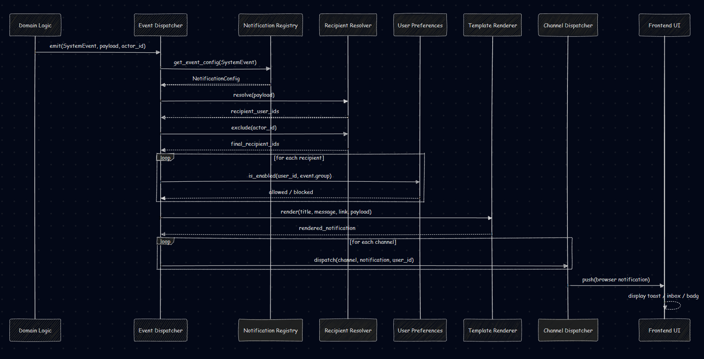

# 🔔 Notification System - Development Guide

> Tài liệu hướng dẫn phát triển hệ thống thông báo real-time cho dự án QLTS.
> **Phiên bản: NOTIFICATION 2.0** (Cập nhật: 2024-12-21)
> **Luu y**: Doc nay can duoc doc cung voi [Backend_FastAPI/NOTIFICATION_PLAN_SPEC_ADDENDUM.md](/D:/QLTS/Backend_FastAPI/NOTIFICATION_PLAN_SPEC_ADDENDUM.md). Neu co xung dot, addendum moi nhat se uu tien hon.

---

## 📋 Mục lục

1. [Tổng quan kiến trúc](#1-tổng-quan-kiến-trúc)
2. [NOTIFICATION 2.0 - Database Rules](#2-notification-20---database-rules)
3. [Các thành phần chính](#3-các-thành-phần-chính)
4. [Flow xử lý notification](#4-flow-xử-lý-notification)
5. [Hướng dẫn thêm event mới](#5-hướng-dẫn-thêm-event-mới)
6. [Frontend Integration](#6-frontend-integration)
7. [Troubleshooting](#7-troubleshooting)

---

## 1. Tổng quan kiến trúc

### NOTIFICATION 2.0 Architecture

```
┌─────────────────────────────────────────────────────────────────────────────────┐
│                      NOTIFICATION 2.0 ARCHITECTURE                               │
├─────────────────────────────────────────────────────────────────────────────────┤
│                                                                                  │
│  ┌──────────────┐    ┌─────────────────────┐    ┌──────────────────────────┐   │
│  │   ROUTER     │───▶│   dispatcher.py     │───▶│   Notification DB        │   │
│  │ (Trigger)    │    │   (Entry Point)     │    │   (Persistence)          │   │
│  └──────────────┘    └─────────────────────┘    └──────────────────────────┘   │
│         │                    │                             │                    │
│         │           ┌────────┴────────┐                   │                    │
│         │           ▼                  ▼                   ▼                    │
│         │    ┌────────────────┐ ┌────────────────┐ ┌────────────────────┐      │
│         │    │ RULE LOADER    │ │ RESOLVERS      │ │ SIDE EFFECTS       │      │
│         │    │ (DB + Redis)   │ │ (Recipients)   │ │ (Socket.IO/Email)  │      │
│         │    │                │ │                │ │                    │      │
│         │    │ 1. DB Rule     │ │ lead_owner     │ │ _emit_domain_event │      │
│         │    │ 2. Registry    │ │ unit_staff     │ │ _send_via_channel  │      │
│         │    │    Fallback    │ │ all_admins     │ │                    │      │
│         │    └────────────────┘ └────────────────┘ └────────────────────┘      │
│                                                                                  │
└─────────────────────────────────────────────────────────────────────────────────┘
```

### Nguyên tắc thiết kế


1. **Event-Driven Architecture**: Các service emit events, notification system subscribe và xử lý
2. **Channel-Based Delivery**: Mỗi kênh (Socket.IO, Email, Database) xử lý độc lập
3. **User Preference Filtering**: Chỉ gửi nếu user bật nhận cho nhóm event đó
4. **Real-time + Persistence**: Socket.IO cho real-time, DB cho lịch sử

---

## 2. Các thành phần chính

### 2.1. SystemEvents (`app/core/events.py`)

Định nghĩa tất cả các event types trong hệ thống:

```python
class SystemEvents(str, Enum):
    # Lead events
    LEAD_ASSIGNED = "lead_assigned"
    LEAD_UPDATED = "lead_updated"
    LEAD_DELETED = "lead_deleted"
    LEAD_CREATED = "lead_created"
    LEAD_STATUS_CHANGED = "lead_status_changed"
    LEAD_REASSIGNED = "lead_reassigned"
    LEAD_ASSIGNMENT_FAILED = "lead_assignment_failed"
    
    # Consultation events
    CONSULTATION_CREATED = "consultation_created"
    CONSULTATION_UPDATED = "consultation_updated"
    CONSULTATION_DELETED = "consultation_deleted"
    CONSULTATION_REMINDER = "consultation_reminder"
    
    # Application events
    APPLICATION_CREATED = "application_created"
    APPLICATION_STATUS_CHANGED = "application_status_changed"
    APPLICATION_DELETED = "application_deleted"
    
    # System events
    SYSTEM_ALERT = "system_alert"
    SYSTEM_ANNOUNCEMENT = "system_announcement"
    USER_ROLE_CHANGED = "user_role_changed"
    USER_DEACTIVATED = "user_deactivated"
    
    # ... và nhiều events khác
```

### 2.2. NotificationEventGroup (`app/core/event_groups.py`)

Nhóm các events thành categories cho preference management:

```python
class NotificationEventGroup(str, Enum):
    LEAD = "lead"              # Lead management
    CONSULTATION = "consultation"  # Consultation records
    APPLICATION = "application"    # Application progress
    FINANCE = "finance"        # Fees, payments
    DORM = "dorm"              # Dormitory
    ASSET = "asset"            # Asset management
    SYSTEM = "system"          # System alerts
    PIPELINE = "pipeline"      # Pipeline config (Admin only)
```

### 2.3. EVENT_GROUP_MAPPING

Map từng event → group:

```python
EVENT_GROUP_MAPPING: Dict[SystemEvents, NotificationEventGroup] = {
    # Lead events → LEAD group
    SystemEvents.LEAD_ASSIGNED: NotificationEventGroup.LEAD,
    SystemEvents.LEAD_UPDATED: NotificationEventGroup.LEAD,
    SystemEvents.LEAD_DELETED: NotificationEventGroup.LEAD,
    
    # Consultation events → CONSULTATION group
    SystemEvents.CONSULTATION_CREATED: NotificationEventGroup.CONSULTATION,
    SystemEvents.CONSULTATION_UPDATED: NotificationEventGroup.CONSULTATION,
    
    # ... và nhiều mappings khác
}
```

> ⚠️ **QUAN TRỌNG**: Mỗi event PHẢI được map vào một group. Nếu thiếu sẽ gây lỗi:
> `"Event SystemEvents.XXX is not mapped to any group"`

### 2.4. Notification Dispatcher (`app/services/notification_dispatcher.py`)

Entry point để dispatch notifications:

```python
from app.services.notification_dispatcher import notification_dispatcher

# Dispatch notification
await notification_dispatcher.dispatch(
    event_type=SystemEvents.LEAD_UPDATED,
    recipients=[officer_id],  # List of user IDs
    data={
        "lead_id": 123,
        "lead_name": "Nguyễn Văn A",
        "updated_fields": ["phone", "email"],
        "message": "Lead đã được cập nhật"
    }
)
```

### 2.5. Notification Channels (`app/services/notification_channels/`)

| Channel | File | Mô tả |
|---------|------|-------|
| Socket.IO | `socket_channel.py` | Emit real-time event qua WebSocket |
| Database | `db_channel.py` | Lưu notification vào DB |
| Email | `email_channel.py` | Queue email task vào Celery |

---

## 3. Flow xử lý notification

### Bước 1: Service dispatch event

```python
# Trong lead_service.py
async def update_lead(db: Session, lead_id: int, data: LeadUpdate):
    # ... update logic ...
    
    # Dispatch notification
    await notification_dispatcher.dispatch(
        event_type=SystemEvents.LEAD_UPDATED,
        recipients=[lead.assigned_officer_id],
        data={
            "lead_id": lead_id,
            "lead_name": lead.full_name,
            "updated_fields": list(data.dict(exclude_unset=True).keys()),
            "message": f"Lead {lead.full_name} đã được cập nhật"
        }
    )
    
    return lead
```

### Bước 2: Dispatcher xử lý

```
┌────────────────────────────────────────────────────────────────────┐
│                     DISPATCHER PROCESSING                           │
├────────────────────────────────────────────────────────────────────┤
│                                                                     │
│  1. 📋 Resolve recipients                                          │
│     └─→ Từ data (lead.assigned_officer_id, unit_id...)             │
│                                                                     │
│  2. 🔍 Tra cứu event group                                         │
│     └─→ EVENT_GROUP_MAPPING[LEAD_UPDATED] = LEAD                   │
│                                                                     │
│  3. ⚙️ Kiểm tra user preferences                                   │
│     └─→ User có bật nhận "LEAD" notifications không?               │
│     └─→ Bật browser? email? sms?                                   │
│                                                                     │
│  4. 📤 Route đến channels                                          │
│     └─→ Browser ON → socket_channel.send()                         │
│     └─→ Email ON → email_channel.send()                            │
│     └─→ DB always → db_channel.save()                              │
│                                                                     │
└────────────────────────────────────────────────────────────────────┘
```

### Bước 3: Channels gửi notification

**Socket Channel:**
```python
# socket_channel.py
async def send(notification: Notification, user_id: int):
    room = f"user_room_{user_id}"
    await sio.emit("new_notification", notification.dict(), room=room)
```

**Database Channel:**
```python
# db_channel.py
async def save(notification: NotificationCreate, db: Session):
    db_notification = Notification(**notification.dict())
    db.add(db_notification)
    await db.commit()
```

**Email Channel:**
```python
# email_channel.py
async def send(notification: Notification, user_email: str):
    # Queue Celery task
    send_notification_email.delay(
        to=user_email,
        subject=notification.title,
        body=notification.message
    )
```

---

## 4. Hướng dẫn thêm event mới

### Bước 1: Thêm event vào `SystemEvents`

```python
# app/core/events.py
class SystemEvents(str, Enum):
    # ... existing events ...
    
    # Thêm event mới
    MY_NEW_EVENT = "my_new_event"
```

### Bước 2: Map event vào group

```python
# app/core/event_groups.py
EVENT_GROUP_MAPPING = {
    # ... existing mappings ...
    
    # Thêm mapping cho event mới
    SystemEvents.MY_NEW_EVENT: NotificationEventGroup.LEAD,  # hoặc group phù hợp
}
```

### Bước 3: Dispatch từ service

```python
# Trong service của bạn
from app.core.events import SystemEvents
from app.services.notification_dispatcher import notification_dispatcher

async def my_function():
    # ... logic ...
    
    await notification_dispatcher.dispatch(
        event_type=SystemEvents.MY_NEW_EVENT,
        recipients=[user_id],
        data={
            "resource_id": 123,
            "message": "Thông báo mới"
        }
    )
```

### Bước 4: Frontend lắng nghe (optional)

```tsx
// SocketHandler.tsx
const handleMyNewEvent = (data: { resource_id: number; message: string }) => {
    console.log("[SocketHandler] my_new_event received:", data);
    
    // Invalidate queries
    queryClient.invalidateQueries({ queryKey: ["my-resource"] });
    
    // Show toast
    toast.info(data.message);
};

// Register listener
socket.on("my_new_event", handleMyNewEvent);
```

---

## 5. Frontend Integration

### 5.1. SocketHandler Component

File: `frontend/src/components/layouts/SocketHandler.tsx`

Đây là component "vô hình" quản lý Socket.IO connection và lắng nghe events:

```tsx
export function SocketHandler() {
    const queryClient = useQueryClient();
    
    useEffect(() => {
        const socket = socketService.getSocket();
        
        // Lắng nghe notification mới
        socket.on("new_notification", (notification) => {
            addNotification(notification);
            playNotificationSound();
            showBrowserNotification(notification.title, notification.message);
            toast.info(notification.title);
        });
        
        // Lắng nghe data updates cho real-time sync
        socket.on("data_updated", (data) => {
            switch (data.resource_type) {
                case "lead":
                    queryClient.invalidateQueries({ queryKey: leadsKeys.lists() });
                    break;
                case "user":
                    queryClient.invalidateQueries({ queryKey: ["admin", "users"] });
                    break;
                // ... other resource types
            }
        });
        
        // Lắng nghe specific events
        socket.on("lead_updated", handleLeadUpdated);
        socket.on("lead_assigned", handleLeadAssigned);
        socket.on("consultation_created", handleConsultationCreated);
        // ... nhiều events khác
        
        return () => {
            socket.off("new_notification");
            socket.off("data_updated");
            // ... cleanup
        };
    }, []);
    
    return null; // No UI
}
```

### 5.2. Socket.IO Rooms

Backend tự động join users vào các rooms:

| Room Pattern | Mô tả |
|--------------|-------|
| `user_room_{user_id}` | Room cá nhân cho mỗi user |
| `role_{role}` | Room theo role (admin, officer, manager) |
| `unit_{unit_id}` | Room theo đơn vị tổ chức |

### 5.3. React Query Integration

Khi nhận event, invalidate queries để trigger refetch:

```tsx
// Invalidate lead list
queryClient.invalidateQueries({ queryKey: leadsKeys.lists() });

// Invalidate specific lead
queryClient.invalidateQueries({ queryKey: leadsKeys.detail(leadId) });

// Force immediate refetch (không dùng cache)
await queryClient.refetchQueries({ queryKey: leadsKeys.lists() });
```

---

## 6. Troubleshooting

### ❌ Lỗi: "Event is not mapped to any group"

**Nguyên nhân**: Event chưa được thêm vào `EVENT_GROUP_MAPPING`

**Fix**:
```python
# app/core/event_groups.py
EVENT_GROUP_MAPPING = {
    # ... 
    SystemEvents.YOUR_EVENT: NotificationEventGroup.APPROPRIATE_GROUP,
}
```

### ❌ Lỗi: Frontend không nhận real-time updates

**Kiểm tra**:
1. Socket.IO connected? (Check console logs)
2. User đã join room đúng chưa?
3. SocketHandler component được mount chưa?
4. Event handler đã register chưa?

**Debug trong browser**:
```javascript
// Mở Console, chạy:
socketService.getSocket().connected  // true?
socketService.getSocket().id         // có socket ID?
```

### ❌ Lỗi: Notification lưu DB nhưng không real-time

**Nguyên nhân**: Socket channel bị lỗi hoặc user preferences tắt browser notification

**Kiểm tra**:
1. User preferences cho group đó
2. Backend logs có emit Socket.IO event không?
3. Redis Pub/Sub hoạt động bình thường?

### ❌ Lỗi: Celery không gửi email

**Kiểm tra**:
1. Celery worker đang chạy?
2. Redis broker connected?
3. Email configuration trong settings?

---

## 📚 Tham khảo thêm

- `app/core/events.py` - Định nghĩa SystemEvents
- `app/core/event_groups.py` - Event group mappings
- `app/services/notification_dispatcher.py` - Main dispatcher
- `app/services/notification_service.py` - Notification logic
- `app/services/notification_channels/` - Channel implementations
- `app/socket_manager.py` - Socket.IO server config
- `frontend/src/components/layouts/SocketHandler.tsx` - Frontend listener
- `frontend/src/lib/socket/client.ts` - Socket.IO client

---

*Cập nhật lần cuối: 2025-12-11*

