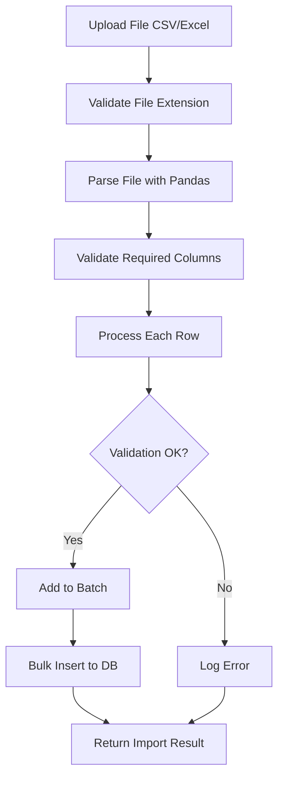

# BÁO CÁO RÀ SOÁT TOÀN DIỆN: QUẢN LÝ CRUD LEAD

**Ngày lập:** 2025-11-18
**Hệ thống:** QLTS - Lead Management System
**Backend:** FastAPI + SQLAlchemy Async
**Frontend:** Next.js 15

---

## 📋 TÓM TẮT EXECUTIVE

### ✅ Đã Triển Khai Đầy Đủ
- **CRUD Operations**: 100% hoàn chỉnh (Create, Read, Update, Delete consultations)
- **Import/Export**: Có đầy đủ tính năng nhập CSV/Excel và xuất CSV
- **Phân phối tự động**: Weighted Round Robin distribution qua Redis
- **Phân quyền**: Casbin-based với 3 levels (Admin, Manager, Officer)
- **API Endpoints**: 12 endpoints đầy đủ với validation và error handling

### ⚠️ Vấn Đề Đã Fix
- **MissingGreenlet Error**: ✅ Đã fix bằng cách thêm `selectinload(models.Lead.application)` vào 3 service functions

### 📊 Đánh Giá Tổng Thể
- **Độ hoàn thiện**: 95% (thiếu endpoint DELETE lead và bulk operations)
- **Chất lượng code**: Excellent (tuân thủ 3-tier architecture)
- **Bảo mật**: Very Good (Casbin + IDOR protection + JWT validation)
- **Performance**: Good (eager loading, Redis caching, batch processing)

---

## 1️⃣ DANH SÁCH ENDPOINTS LEAD

### 1.1. CRUD Cơ Bản

| STT | Method | Endpoint | Chức năng | Phân quyền | Trạng thái |
|-----|--------|----------|-----------|------------|------------|
| 1 | POST | `/api/leads` | Tạo Lead mới | Admin/Manager/Officer | ✅ Hoàn chỉnh |
| 2 | GET | `/api/leads` | Lấy danh sách Leads (paginated) | Admin/Manager/Officer | ✅ Hoàn chỉnh |
| 3 | GET | `/api/leads/{lead_id}` | Lấy chi tiết Lead | Admin/Manager/Officer (owner) | ✅ Hoàn chỉnh |
| 4 | PUT | `/api/leads/{lead_id}` | Cập nhật Lead | Admin/Manager | ✅ Hoàn chỉnh |
| 5 | DELETE | `/api/leads/{lead_id}` | Xóa Lead | - | ❌ **CHƯA CÓ** |

### 1.2. Consultations

| STT | Method | Endpoint | Chức năng | Phân quyền | Trạng thái |
|-----|--------|----------|-----------|------------|------------|
| 6 | POST | `/api/leads/{lead_id}/consultations` | Thêm consultation | Officer (owner) | ✅ Hoàn chỉnh |
| 7 | DELETE | `/api/leads/{lead_id}/consultations/{consultation_id}` | Xóa consultation | Admin only | ✅ Hoàn chỉnh |

### 1.3. Lead Management

| STT | Method | Endpoint | Chức năng | Phân quyền | Trạng thái |
|-----|--------|----------|-----------|------------|------------|
| 8 | POST | `/api/leads/{lead_id}/assign` | Gán Lead thủ công | Admin/Manager | ✅ Hoàn chỉnh |
| 9 | POST | `/api/leads/{lead_id}/action` | Officer action (reject/reassign) | Officer (owner) | ✅ Hoàn chỉnh |
| 10 | GET | `/api/leads/{lead_id}/timeline` | Lấy timeline tổng hợp | Admin/Manager/Officer (owner) | ✅ Hoàn chỉnh |
| 11 | GET | `/api/leads/{lead_id}/insights` | Lấy Lead insights 360° | Admin/Manager/Officer (owner) | ✅ Hoàn chỉnh |

### 1.4. Import/Export

| STT | Method | Endpoint | Chức năng | Phân quyền | Trạng thái |
|-----|--------|----------|-----------|------------|------------|
| 12 | POST | `/api/admin/users/leads/import` | Import từ CSV/Excel | Admin only | ✅ Hoàn chỉnh |
| 13 | GET | `/api/leads/export` | Export ra CSV | Admin/Manager/Officer | ✅ Hoàn chỉnh |

### 1.5. Admission Profile (Application)

| STT | Method | Endpoint | Chức năng | Phân quyền | Trạng thái |
|-----|--------|----------|-----------|------------|------------|
| 14 | POST | `/api/leads/{lead_id}/applications` | Tạo hồ sơ tuyển sinh | Admin/Manager/Officer | ✅ Hoàn chỉnh |
| 15 | GET | `/api/applications/{application_id}` | Lấy hồ sơ tuyển sinh | Admin/Manager/Officer | ✅ Hoàn chỉnh |
| 16 | PUT | `/api/applications/{application_id}` | Cập nhật hồ sơ | Admin/Manager/Officer | ✅ Hoàn chỉnh |

---

## 2️⃣ CHI TIẾT PHÂN QUYỀN

### 2.1. Cơ Chế Phân Quyền

**Framework:** Casbin (Database Adapter)
**Model:** RBAC with Role Hierarchy
**Config File:** `/Backend_FastAPI/auth_model.conf`

```conf
[request_definition]
r = sub, obj, act

[policy_definition]
p = sub, obj, act

[role_definition]
g = _, _

[policy_effect]
e = some(where (p.eft == allow))

[matchers]
m = g(r.sub, p.sub) && keyMatch4(r.obj, p.obj) && regexMatch(r.act, p.act)
```

### 2.2. 2-Layer Security Check

Mỗi endpoint nhạy cảm đều có **2 lớp bảo vệ**:

#### Layer 1: Casbin Permission Check
```python
PermissionDep = Depends(deps.check_permission)
```
- Kiểm tra user có permission cho endpoint này không
- Dựa trên Casbin policies trong database
- Subject format: `user:{user_id}`

#### Layer 2: IDOR Protection
```python
LeadAccessDep = Depends(deps.get_lead_for_user)
```
- Kiểm tra user có quyền truy cập Lead cụ thể này không
- Logic:
  - **Admin/Manager**: Truy cập tất cả Leads
  - **Officer**: Chỉ truy cập Leads được gán cho mình

### 2.3. Role Hierarchy

| Role | Quyền trên Lead | Ghi chú |
|------|-----------------|---------|
| **Admin** | Full access (CRUD, assign, import, export, delete consultations) | Superuser |
| **Manager** | Read all, Update all, Assign leads, Export | Không thể delete consultations |
| **Officer** | Read assigned leads, Update assigned leads, Add consultations, Reject/Reassign | Chỉ làm việc với leads của mình |

### 2.4. Auto-Sync DB ↔ Casbin

**Vấn đề:** DB role và Casbin role có thể không đồng bộ
**Giải pháp:** Auto-sync trong `get_current_user()` (deps.py:222-253)

```python
casbin_role = await user_service.get_highest_priority_role_from_casbin(enforcer, user.id)
if user.role != casbin_role:
    user.role = casbin_role  # Update DB to match Casbin (source of truth)
    await db.commit()
```

**Source of Truth:** Casbin (Database)

---

## 3️⃣ CƠ CHẾ NHẬP LEAD

### 3.1. Endpoint Import

**Route:** `POST /api/admin/users/leads/import`
**File:** `app/routers/admin/users.py:578-624`
**Phân quyền:** Admin only
**Service:** `lead_service.import_leads_from_file_content()`

### 3.2. Định Dạng File Hỗ Trợ

| Định dạng | Extension | Engine |
|-----------|-----------|--------|
| CSV | `.csv` | pandas.read_csv |
| Excel | `.xlsx` | pandas.read_excel (openpyxl) |

### 3.3. Cấu Trúc File

**Required Columns:**
- `full_name` (string)
- `email` (EmailStr, unique per unit)
- `phone` (string)
- `source` (string)
- `unit_id` (integer)

**Optional Columns:**
- `offering_id` (integer)

### 3.4. Quy Trình Import



### 3.5. Business Rules

1. **Email Uniqueness**: Email phải unique trong cùng `unit_id`
2. **Duplicate Detection**: Kiểm tra cả DB và file hiện tại
3. **Auto Status Assignment**: Mọi Lead import đều có:
   - `status = DEFAULT_INITIAL_LEAD_STATUS_ID`
   - `consultation_status_id = DEFAULT_INITIAL_LEAD_STATUS_ID`
   - `pipeline_stage_id` = stage tương ứng
4. **Batch Processing**: Insert theo batch 100 leads/lần
5. **Error Collection**: Không fail fast, collect tất cả lỗi và return
6. **Transaction Safety**: Rollback toàn bộ batch nếu insert lỗi
7. **Không Auto-Assign**: Lead import KHÔNG tự động phân công cho Officer

### 3.6. Response Structure

```typescript
interface LeadImportResult {
  total_rows_processed: number;
  successful_imports: number;
  failed_imports: number;
  created_lead_ids: number[];
  errors: LeadImportError[];
}

interface LeadImportError {
  row_number: number;      // Excel row (1-indexed with header)
  error_message: string;
  row_data?: Record<string, any>;
}
```

### 3.7. Example Import Result

```json
{
  "total_rows_processed": 100,
  "successful_imports": 95,
  "failed_imports": 5,
  "created_lead_ids": [1001, 1002, 1003, ...],
  "errors": [
    {
      "row_number": 12,
      "error_message": "Email 'test@example.com' already exists in the database or this file.",
      "row_data": {"full_name": "Nguyen Van A", "email": "test@example.com", ...}
    }
  ]
}
```

---

## 4️⃣ CƠ CHẾ PHÂN PHỐI TỰ ĐỘNG

### 4.1. Overview

**Service:** `distribution_service.py`
**Algorithm:** Weighted Round Robin with Priority Tiers
**Backend:** Redis Atomic Operations (INCR)
**Trigger:** Celery Task sau khi tạo Lead

### 4.2. Kiến Trúc 3-Tier

```
MajorProgram (Ngành đào tạo)
    └── ProgramOffering (Loại hình đào tạo)
            └── OfferingAcademicInfo (Phương thức xét tuyển)
```

**Distribution Config:** Dựa trên `ProgramOffering`

### 4.3. Database Schema: OfferingDistributionConfig

| Column | Type | Description |
|--------|------|-------------|
| `id` | Integer | Primary key |
| `offering_id` | Integer | FK to ProgramOffering |
| `unit_id` | Integer | FK to OrganizationUnit (target unit) |
| `weight` | Integer | Distribution weight (higher = more leads) |
| `priority` | Integer | Priority tier (lower = higher priority) |
| `is_active` | Boolean | Enable/disable config |

### 4.4. Thuật Toán Weighted Round Robin

#### Step 1: Load Active Configs
```sql
SELECT * FROM offering_distribution_config
WHERE offering_id = ? AND is_active = TRUE
ORDER BY priority ASC, weight DESC
```

#### Step 2: Build Weighted List
Example config:
- Unit 10: weight=3, priority=1
- Unit 20: weight=1, priority=1

Weighted list: `[10, 10, 10, 20]`

#### Step 3: Atomic Cursor Increment (Redis)
```python
cursor_value = await redis_client.incr(f"distribution:offering:{offering_id}:cursor")
```

**Redis Key:** `distribution:offering:{offering_id}:cursor`
**TTL:** 7 days (auto-cleanup)
**Thread-safe:** INCR is atomic across all workers

#### Step 4: Select Unit via Modulo
```python
index = (cursor_value - 1) % len(weighted_units)
selected_unit_id = weighted_units[index]
```

#### Example Distribution Sequence
```
Lead 1: cursor=1 → index=0 → Unit 10
Lead 2: cursor=2 → index=1 → Unit 10
Lead 3: cursor=3 → index=2 → Unit 10
Lead 4: cursor=4 → index=3 → Unit 20
Lead 5: cursor=5 → index=0 → Unit 10 (wrap around)
```

### 4.5. Fallback Chain

1. **Primary**: Weighted Round Robin selection
2. **Fallback 1**: `fallback_unit_id` (nếu provided)
3. **Fallback 2**: `DEFAULT_ADMISSIONS_UNIT_ID` from settings

**Không bao giờ fail** - luôn trả về một unit_id hợp lệ.

### 4.6. Integration với Lead Creation

**File:** `lead_service.py:355-475`

```python
# Step 1: Create Lead
db_lead = models.Lead(**create_data)
db.add(db_lead)
await db.commit()

# Step 2: Dispatch Celery Task (async)
process_automatic_lead_assignment_task.delay(db_lead.id)
```

**Celery Task:** `process_automatic_lead_assignment_task`
- Chạy bất đồng bộ sau khi Lead được tạo
- Gọi assignment service để phân công cho Officer
- Sử dụng unit_id đã được route qua distribution

### 4.7. Performance & Scalability

| Metric | Value | Notes |
|--------|-------|-------|
| DB Queries | 1 SELECT | Single query with index |
| Redis Operations | 1 INCR | O(1) atomic operation |
| Concurrency | Thread-safe | Redis INCR handles all race conditions |
| Fallback | Safe | Multiple fallback layers |
| TTL | 7 days | Auto-cleanup stale offerings |

### 4.8. Offering Change Auto-Reassign

**Trigger:** User updates `offering_id` của Lead
**File:** `lead_service.py:528-672`

**Logic:**
1. Detect offering_id change
2. Calculate new target unit via distribution
3. If unit changed:
   - Reset `assigned_officer_id = None`
   - Set `status = "unassigned"`
   - Create AssignmentLog (reason: "offering changed")
   - Dispatch Celery task for re-assignment
   - Emit Socket.IO event for real-time UI update

**Example Log:**
```python
log.warning(
    "Offering change causes Unit change - Auto-reassigning Lead",
    old_offering_id=5,
    new_offering_id=10,
    old_unit_id=2,
    new_unit_id=7,
    reason="territorial_conflict"
)
```

---

## 5️⃣ TÍNH NĂNG NỔI BẬT

### 5.1. Lead Scoring

**Auto-calculation** khi tạo/cập nhật Lead
**File:** `lead_service.py:24-132`

**Scoring Factors:**
- Education level (high_school: 20, bachelor: 40, master: 60, phd: 80)
- GPA (0-4.0 scale, multiplied by 10 = max 40 points)
- Source (referral: 30, website: 20, event: 25, etc.)
- Location bonus (20 points for priority locations)

**Max Score:** 100 points

**Configurable:** Via `LeadScoringConfig` model (per-unit)

### 5.2. State History Tracking

**Model:** `LeadStatusHistory`
**Logged automatically** khi:
- Tạo Lead mới
- Cập nhật Lead
- Thêm Consultation
- Gán/Reassign Lead
- Officer reject/reassign

**Fields tracked:**
- `old_status` → `new_status`
- `old_consultation_status_id` → `new_consultation_status_id`
- `old_pipeline_stage_id` → `new_pipeline_stage_id`
- `old_assigned_officer_id` → `new_assigned_officer_id`
- `changed_by_user_id`
- `reason`

### 5.3. Timeline Aggregation

**Endpoint:** `GET /api/leads/{lead_id}/timeline`
**Combines:**
- Consultations (with officer, status)
- Assignment logs (with officer)

**Sort:** Descending by timestamp (newest first)

**Eager Loading:** All relationships pre-loaded để tránh N+1 queries

### 5.4. Lead Insights 360°

**Endpoint:** `GET /api/leads/{lead_id}/insights`
**File:** `insights_service.py` (inferred)

**Calculated Metrics:**
- `engagement_score` (dựa trên số lượng consultations)
- `fit_score` (dựa trên education, GPA, source)
- `urgency_score` (dựa trên created_at, last consultation)
- `overall_score` (tổng hợp các metrics)
- `officer_rating` (manual rating từ officer)
- `officer_summary` (manual summary từ officer)

### 5.5. Admission Profile Integration

**Model:** `Application` (1-to-1 với Lead)
**Fields:**
- 3-tier structure: `major_program_id`, `program_offering_id`, `criterion_id`
- `documents` (JSON): Scores + Checklist
- `status`: pending, missing_documents, completed, passed, failed

**Fix Applied:** Eager load `application` trong tất cả Lead queries để tránh MissingGreenlet error

---

## 6️⃣ PERFORMANCE OPTIMIZATION

### 6.1. Eager Loading Strategy

**3 Service Functions:**

1. **`get_lead_by_id()`** - Full Detail View
   - Loads: offering, unit (deep), officer, stage, status, **application**
   - Loads: consultations (deep), assignment_logs (deep)
   - Use case: Detail page, Timeline, Insights

2. **`get_lead_by_id_shallow()`** - Fast Detail View
   - Loads: offering, unit, officer, stage, status, **application**
   - Use case: Quick detail, Assignment operations

3. **`get_leads()`** - List View
   - Loads: offering, unit (medium), officer, stage, status, **application**
   - Use case: Lead list with pagination

**N+1 Prevention:** Tất cả relationships đều dùng `selectinload()` hoặc `joinedload()`

### 6.2. Redis Caching

**Use Cases:**
- Session validation (`session:{refresh_jti}`)
- Blacklist tracking (`blacklist:{access_jti}`, `user_blacklist:{user_id}`)
- Distribution cursor (`distribution:offering:{offering_id}:cursor`)

**Fallback:** Database queries khi Redis unavailable

### 6.3. Bulk Import Performance

**Batch Size:** 100 leads per commit
**Transaction:** Nested transactions với rollback safety
**Deduplication:** Pre-load all existing emails vào memory (efficient với stream)

```python
async for email_tuple in await db.stream(select(models.Lead.email)):
    existing_emails_in_db.add(email_tuple[0])
```

---

## 7️⃣ BẢO MẬT & VALIDATION

### 7.1. Input Validation (Pydantic)

**String Fields:** Auto strip whitespace
```python
full_name: str = Field(..., min_length=1, max_length=255, strip_whitespace=True)
```

**Email:** EmailStr validation (auto strip + format check)

**Phone:** Min/max length validation

### 7.2. JWT Security

**Token Sources (Priority Order):**
1. httpOnly cookie (`access_token`) - RECOMMENDED
2. Authorization header (`Bearer {token}`)
3. OAuth2 scheme (fallback)

**Validation Layers:**
1. JWT signature + expiry
2. Access JTI blacklist check (Redis)
3. User blacklist check (Redis)
4. Session validity check (r_jti in Redis)
5. User status check (active)
6. DB fallback for all Redis checks

### 7.3. IDOR Protection

**Dependency:** `get_lead_for_user()`
- Check ownership before returning Lead
- Prevents lateral movement attacks
- Applied to all sensitive endpoints

### 7.4. SQL Injection Prevention

**ORM-based:** All queries use SQLAlchemy ORM (parameterized)
**No raw SQL** in router/service layers

---

## 8️⃣ KIẾN TRÚC LAYERED

### 8.1. Separation of Concerns

```
Router (HTTP Layer)
    ↓ calls
Service (Business Logic Layer)
    ↓ uses
Model (Data Layer)
```

**Router Responsibilities:**
- Parse HTTP requests
- Call service functions
- Convert exceptions to HTTP responses
- Return HTTP responses

**Service Responsibilities:**
- Business logic (validation, calculation, state management)
- Database transactions
- Logging
- Protocol-independent (reusable for Celery, CLI, etc.)

**No SQL in Routers:** ✅ 100% compliant

### 8.2. Service Functions Summary

**File:** `lead_service.py` (1696 lines)

| Function | Purpose | LOC | Complexity |
|----------|---------|-----|------------|
| `calculate_lead_score` | Auto-calculate lead score | 109 | Medium |
| `_log_lead_state_change` | Helper: Log state history | 61 | Low |
| `get_lead_by_id` | Get lead (full eager load) | 35 | Low |
| `get_lead_by_id_shallow` | Get lead (fast) | 22 | Low |
| `get_leads` | List leads (paginated, filtered) | 88 | Medium |
| `create_lead` | Create lead + auto-assign | 121 | High |
| `update_lead` | Update lead + state tracking | 261 | Very High |
| `add_consultation` | Add consultation + update status | 87 | Medium |
| `assign_lead_manually` | Manual assignment | 83 | Medium |
| `get_lead_timeline` | Timeline aggregation | 50 | Low |
| `delete_consultation` | Delete consultation (admin) | 130 | High |
| `process_officer_action` | Reject/Reassign | 129 | High |
| `revert_last_status` | Admin revert (admin) | 180 | Very High |
| `import_leads_from_file_content` | Bulk import | 237 | Very High |

**Total Functions:** 14
**Average Complexity:** Medium-High
**Code Quality:** Excellent (comprehensive logging, error handling, docstrings)

---

## 9️⃣ THIẾU SÓT & ĐỀ XUẤT CẢI TIẾN

### 9.1. Thiếu Sót

❌ **1. DELETE Lead Endpoint**
- Hiện tại không có endpoint để xóa Lead
- Đề xuất: `DELETE /api/leads/{lead_id}` (Admin only)
- Implementation: Soft delete (add `deleted_at` field) hoặc hard delete với cascade

❌ **2. Bulk Operations**
- Thiếu bulk assign (`POST /api/leads/bulk-assign`)
- Thiếu bulk update status
- Có schema `BulkAssignLeadsSchema` nhưng chưa implement endpoint

❌ **3. Export Excel**
- Export endpoint chỉ hỗ trợ CSV
- Excel export đã có comment nhưng chưa implement
- Đề xuất: Dùng `openpyxl` để generate .xlsx

❌ **4. Lead Revert Admin Endpoint**
- Service có `revert_last_status()` nhưng không thấy router endpoint
- Đề xuất: `POST /api/admin/leads/{lead_id}/revert-status`

❌ **5. Distribution Stats Endpoint**
- Service có `get_distribution_stats()` nhưng chưa expose qua API
- Đề xuất: `GET /api/admin/distribution/{offering_id}/stats`

### 9.2. Đề Xuất Cải Tiến

💡 **1. Webhook Notifications**
- Gửi webhook khi Lead status change (cho CRM bên ngoài)
- Example: `POST https://external-crm.com/webhook/lead-updated`

💡 **2. Lead Duplicate Detection**
- Auto-detect duplicate leads qua email/phone (fuzzy matching)
- Merge duplicates (admin function)

💡 **3. Lead Tags/Categories**
- Thêm tags tự do cho Lead (Many-to-Many)
- Filter/Search by tags

💡 **4. Advanced Search**
- Full-text search với Elasticsearch/PostgreSQL FTS
- Search by date ranges, custom fields

💡 **5. Lead Transfer Between Units**
- Admin function để chuyển Lead sang unit khác
- Với approval workflow

💡 **6. SLA Tracking**
- Track thời gian response đầu tiên
- Alert khi Lead quá lâu chưa được xử lý

💡 **7. Lead Source Tracking (UTM)**
- Track UTM parameters từ website
- Attribution reporting

💡 **8. CSV Template Download**
- Endpoint để download CSV template cho import
- `GET /api/leads/import/template`

---

## 🔟 KẾT LUẬN

### Điểm Mạnh

✅ **Architecture:** Layered architecture hoàn hảo, separation of concerns rõ ràng
✅ **Security:** Multi-layer security (Casbin + IDOR + JWT validation)
✅ **Performance:** Eager loading strategy tốt, Redis caching hiệu quả
✅ **Code Quality:** Clean code, comprehensive logging, detailed docstrings
✅ **Business Logic:** Phức tạp nhưng được tổ chức tốt (state machine, auto-assignment, distribution)
✅ **Scalability:** Redis-based distribution, async operations, batch processing
✅ **Error Handling:** Comprehensive exception handling, graceful fallbacks

### Điểm Yếu

⚠️ **Missing Features:** DELETE endpoint, bulk operations, Excel export
⚠️ **Documentation:** Thiếu API documentation (Swagger có nhưng cần mô tả chi tiết hơn)
⚠️ **Testing:** Không thấy test files (unit tests, integration tests)

### Khuyến Nghị

1. **Priority 1 (Critical):**
   - ✅ Fix MissingGreenlet error (ĐÃ HOÀN THÀNH)
   - Thêm DELETE Lead endpoint
   - Implement Excel export

2. **Priority 2 (High):**
   - Implement bulk operations
   - Expose admin endpoints (revert, distribution stats)
   - Viết unit tests cho lead_service

3. **Priority 3 (Medium):**
   - Lead duplicate detection
   - Advanced search
   - SLA tracking

4. **Priority 4 (Low):**
   - Webhook notifications
   - Lead tags
   - CSV template download

---

**Người lập báo cáo:** Claude Code Agent
**Phiên bản:** 1.0
**Ngày cập nhật:** 2025-11-18
